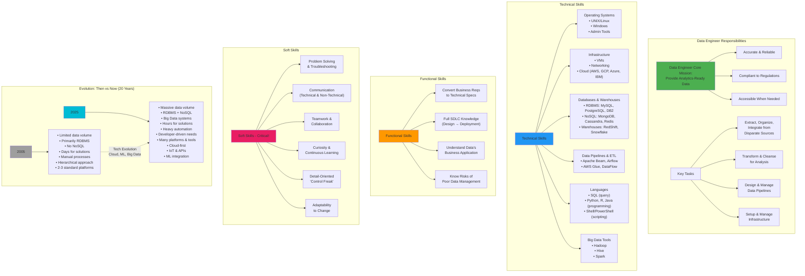

```mermaid
graph TB
    subgraph "Data Engineer Responsibilities"
        MainResp[Data Engineer Core Mission:<br/>Provide Analytics-Ready Data]
        MainResp --> Accurate[Accurate & Reliable]
        MainResp --> Compliant[Compliant to Regulations]
        MainResp --> Accessible[Accessible When Needed]
        
        Tasks[Key Tasks]
        Tasks --> T1["Extract, Organize,<br/>Integrate from<br/>Disparate Sources"]
        Tasks --> T2["Transform & Cleanse<br/>for Analysis"]
        Tasks --> T3["Design & Manage<br/>Data Pipelines"]
        Tasks --> T4["Setup & Manage<br/>Infrastructure"]
    end
    
    subgraph "Technical Skills"
        Tech[Technical Skills]
        
        Tech --> OS["Operating Systems<br/>• UNIX/Linux<br/>• Windows<br/>• Admin Tools"]
        
        Tech --> Infra["Infrastructure<br/>• VMs<br/>• Networking<br/>• Cloud (AWS, GCP, Azure, IBM)"]
        
        Tech --> DB["Databases & Warehouses<br/>• RDBMS: MySQL, PostgreSQL, DB2<br/>• NoSQL: MongoDB, Cassandra, Redis<br/>• Warehouses: RedShift, Snowflake"]
        
        Tech --> Pipeline["Data Pipelines & ETL<br/>• Apache Beam, Airflow<br/>• AWS Glue, DataFlow"]
        
        Tech --> Lang["Languages<br/>• SQL (query)<br/>• Python, R, Java (programming)<br/>• Shell/PowerShell (scripting)"]
        
        Tech --> BigData["Big Data Tools<br/>• Hadoop<br/>• Hive<br/>• Spark"]
    end
    
    subgraph "Functional Skills"
        Func[Functional Skills]
        Func --> F1["Convert Business Reqs<br/>to Technical Specs"]
        Func --> F2["Full SDLC Knowledge<br/>(Design → Deployment)"]
        Func --> F3["Understand Data's<br/>Business Application"]
        Func --> F4["Know Risks of<br/>Poor Data Management"]
    end
    
    subgraph "Soft Skills"
        Soft[Soft Skills - Critical!]
        Soft --> S1["Problem Solving<br/>& Troubleshooting"]
        Soft --> S2["Communication<br/>(Technical & Non-Technical)"]
        Soft --> S3["Teamwork &<br/>Collaboration"]
        Soft --> S4["Curiosity &<br/>Continuous Learning"]
        Soft --> S5["Detail-Oriented<br/>'Control Freak'"]
        Soft --> S6["Adaptability<br/>to Change"]
    end
    
    subgraph "Evolution: Then vs Now (20 Years)"
        Then["2005"]
        Now["2025"]
        
        Then --> Old["• Limited data volume<br/>• Primarily RDBMS<br/>• No NoSQL<br/>• Days for solutions<br/>• Manual processes<br/>• Hierarchical approach<br/>• 2-3 standard platforms"]
        
        Now --> New["• Massive data volume<br/>• RDBMS + NoSQL<br/>• Big Data systems<br/>• Hours for solutions<br/>• Heavy automation<br/>• Developer-driven needs<br/>• Many platforms & tools<br/>• Cloud-first<br/>• IoT & APIs<br/>• ML integration"]
        
        Old -.->|"Tech Evolution<br/>Cloud, ML, Big Data"| New
    end
    
    style MainResp fill:#4CAF50
    style Tech fill:#2196F3
    style Func fill:#FF9800
    style Soft fill:#E91E63
    style Then fill:#9E9E9E
    style Now fill:#00BCD4
```