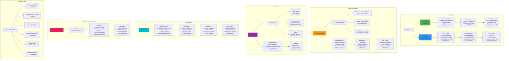

```mermaid
graph TB
    subgraph "Databases"
        DB[Databases]
        
        DB --> RDBMS["RDBMS<br/>Relational"]
        RDBMS --> RDBMS_Char["Characteristics:<br/>• Tabular (rows/columns)<br/>• Fixed schema<br/>• SQL querying<br/>• ACID compliance"]
        RDBMS_Char --> RDBMS_Examples["Examples:<br/>• MySQL, PostgreSQL<br/>• Oracle, SQL Server<br/>• IBM DB2"]
        RDBMS_Examples --> RDBMS_Use["Use Cases:<br/>• OLTP transactions<br/>• Structured data<br/>• Data warehousing<br/>• IoT solutions"]
        
        DB --> NoSQL["NoSQL<br/>Non-Relational"]
        NoSQL --> NoSQL_Types["Four Types:<br/>• Key-Value (Redis)<br/>• Document (MongoDB)<br/>• Column (Cassandra)<br/>• Graph (Neo4J)"]
        NoSQL_Types --> NoSQL_Char["Characteristics:<br/>• Flexible schema<br/>• Horizontal scaling<br/>• Various data models<br/>• Cloud-friendly"]
        NoSQL_Char --> NoSQL_Use["Use Cases:<br/>• Big Data<br/>• Real-time apps<br/>• Semi/unstructured data<br/>• Rapid development"]
    end
    
    subgraph "Data Warehouses"
        DWH[Data Warehouse]
        DWH --> DWH_Arch["3-Tier Architecture"]
        
        DWH_Arch --> Bottom["Bottom: Database Servers<br/>Extract from sources"]
        DWH_Arch --> Middle["Middle: OLAP Server<br/>Process & analyze"]
        DWH_Arch --> Top["Top: Client Front-End<br/>Query, report, analyze"]
        
        DWH --> DWH_Char["Characteristics:<br/>• Central repository<br/>• Cleansed data<br/>• Historical + current<br/>• Analysis-ready"]
        
        DWH_Char --> DWH_Examples["Examples:<br/>• Snowflake<br/>• Amazon RedShift<br/>• Google BigQuery<br/>• Teradata"]
        
        DWH_Examples --> DWH_Use["Use Cases:<br/>• Business Intelligence<br/>• OLAP analytics<br/>• Historical analysis<br/>• Reporting"]
    end
    
    subgraph "Data Marts"
        DM[Data Mart]
        DM --> DM_Types["Three Types"]
        
        DM_Types --> Dependent["Dependent<br/>From DWH<br/>Pre-cleaned"]
        DM_Types --> Independent["Independent<br/>From operational<br/>Need transformation"]
        DM_Types --> Hybrid["Hybrid<br/>Multiple sources<br/>Combined inputs"]
        
        DM --> DM_Char["Characteristics:<br/>• Subset of DWH<br/>• Specific business function<br/>• Faster queries<br/>• Isolated security"]
        
        DM_Char --> DM_Examples["Examples:<br/>• Sales Mart<br/>• Finance Mart<br/>• Marketing Mart"]
    end
    
    subgraph "Data Lakes"
        DL[Data Lake]
        DL --> DL_Char["Characteristics:<br/>• Raw data in native format<br/>• All data types<br/>• Schema-on-read<br/>• Governed & classified"]
        
        DL_Char --> DL_Tech["Technologies:<br/>• Cloud Storage (S3)<br/>• Hadoop HDFS<br/>• NoSQL stores<br/>• Object storage"]
        
        DL_Tech --> DL_Benefits["Benefits:<br/>✓ Store all data types<br/>✓ Agile scaling<br/>✓ No upfront structure<br/>✓ Future flexibility"]
        
        DL_Benefits --> DL_Use["Use Cases:<br/>• Big Data storage<br/>• ML training data<br/>• Exploratory analysis<br/>• Data science"]
    end
    
    subgraph "Modern: Data Lakehouse"
        Lakehouse[Data Lakehouse]
        Lakehouse --> LH_Combine["Combines:<br/>Lake + Warehouse"]
        
        LH_Combine --> LH_Benefits["Benefits:<br/>• Flexibility of lake<br/>• Performance of warehouse<br/>• BI + ML workloads<br/>• Built-in governance"]
        
        LH_Benefits --> LH_Use["Use Cases:<br/>• Modern analytics<br/>• AI/ML workloads<br/>• Real-time + batch<br/>• Cost optimization"]
    end
    
    subgraph "Selection Guide"
        Guide[Choose Based On]
        
        Guide --> Q1["Structured, ACID?<br/>→ RDBMS"]
        Guide --> Q2["Flexible schema, scale?<br/>→ NoSQL"]
        Guide --> Q3["Historical analytics?<br/>→ Data Warehouse"]
        Guide --> Q4["Department-specific?<br/>→ Data Mart"]
        Guide --> Q5["Raw, all types?<br/>→ Data Lake"]
        Guide --> Q6["Modern BI + ML?<br/>→ Lakehouse"]
    end
    
    style RDBMS fill:#4CAF50
    style NoSQL fill:#2196F3
    style DWH fill:#FF9800
    style DM fill:#9C27B0
    style DL fill:#00BCD4
    style Lakehouse fill:#E91E63
```    