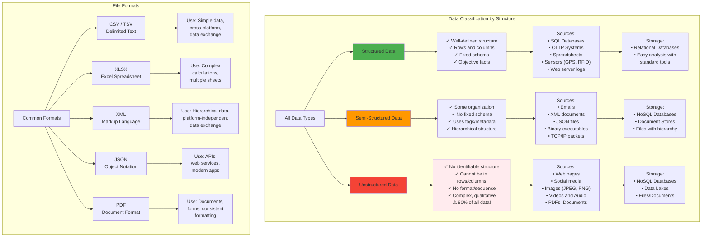

```mermaid
graph TB
    subgraph "Data Classification by Structure"
        Data[All Data Types]
        
        Data --> Structured[Structured Data]
        Data --> SemiStructured[Semi-Structured Data]
        Data --> Unstructured[Unstructured Data]
        
        Structured --> S_Char["✓ Well-defined structure<br/>✓ Rows and columns<br/>✓ Fixed schema<br/>✓ Objective facts"]
        S_Char --> S_Sources["Sources:<br/>• SQL Databases<br/>• OLTP Systems<br/>• Spreadsheets<br/>• Sensors (GPS, RFID)<br/>• Web server logs"]
        S_Sources --> S_Storage["Storage:<br/>• Relational Databases<br/>• Easy analysis with<br/>  standard tools"]
        
        SemiStructured --> SS_Char["✓ Some organization<br/>✓ No fixed schema<br/>✓ Uses tags/metadata<br/>✓ Hierarchical structure"]
        SS_Char --> SS_Sources["Sources:<br/>• Emails<br/>• XML documents<br/>• JSON files<br/>• Binary executables<br/>• TCP/IP packets"]
        SS_Sources --> SS_Storage["Storage:<br/>• NoSQL Databases<br/>• Document Stores<br/>• Files with hierarchy"]
        
        Unstructured --> U_Char["✓ No identifiable structure<br/>✓ Cannot be in rows/columns<br/>✓ No format/sequence<br/>✓ Complex, qualitative<br/>⚠ 80% of all data!"]
        U_Char --> U_Sources["Sources:<br/>• Web pages<br/>• Social media<br/>• Images (JPEG, PNG)<br/>• Videos and Audio<br/>• PDFs, Documents"]
        U_Sources --> U_Storage["Storage:<br/>• NoSQL Databases<br/>• Data Lakes<br/>• Files/Documents"]
    end
    
    subgraph "File Formats"
        FF[Common Formats]
        
        FF --> CSV["CSV / TSV<br/>Delimited Text"]
        FF --> XLSX["XLSX<br/>Excel Spreadsheet"]
        FF --> XML["XML<br/>Markup Language"]
        FF --> JSON["JSON<br/>Object Notation"]
        FF --> PDF["PDF<br/>Document Format"]
        
        CSV --> CSV_Use["Use: Simple data,<br/>cross-platform,<br/>data exchange"]
        XLSX --> XLSX_Use["Use: Complex<br/>calculations,<br/>multiple sheets"]
        XML --> XML_Use["Use: Hierarchical data,<br/>platform-independent<br/>data exchange"]
        JSON --> JSON_Use["Use: APIs,<br/>web services,<br/>modern apps"]
        PDF --> PDF_Use["Use: Documents,<br/>forms, consistent<br/>formatting"]
    end
    
    style Structured fill:#4CAF50
    style SemiStructured fill:#FF9800
    style Unstructured fill:#F44336
    style U_Char fill:#ffebee
```