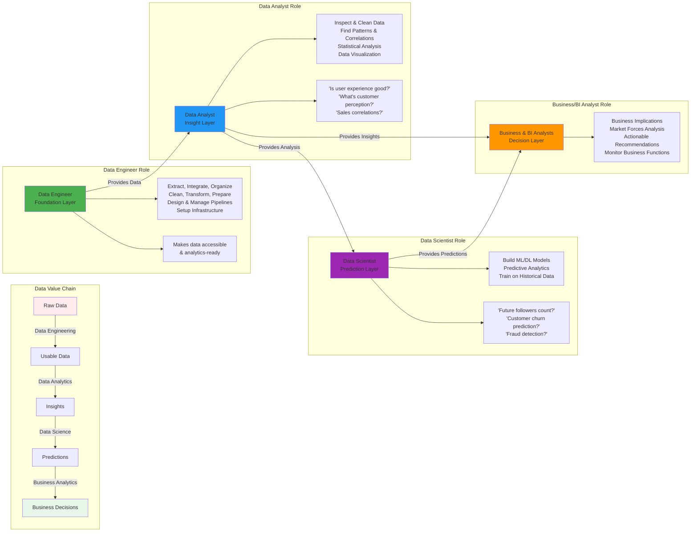

```mermaid
graph LR
    subgraph "Data Value Chain"
        RawData[Raw Data] --> |Data Engineering| UsableData[Usable Data]
        UsableData --> |Data Analytics| Insights[Insights]
        Insights --> |Data Science| Predictions[Predictions]
        Predictions --> |Business Analytics| Decisions[Business Decisions]
    end
    
    subgraph "Data Engineer Role"
        DE[Data Engineer<br/>Foundation Layer]
        DE --> Responsibilities["Extract, Integrate, Organize<br/>Clean, Transform, Prepare<br/>Design & Manage Pipelines<br/>Setup Infrastructure"]
        DE --> Focus["Makes data accessible<br/>& analytics-ready"]
    end
    
    subgraph "Data Analyst Role"
        DA[Data Analyst<br/>Insight Layer]
        DA --> DAResp["Inspect & Clean Data<br/>Find Patterns & Correlations<br/>Statistical Analysis<br/>Data Visualization"]
        DA --> Questions["'Is user experience good?'<br/>'What's customer perception?'<br/>'Sales correlations?'"]
    end
    
    subgraph "Data Scientist Role"
        DSci[Data Scientist<br/>Prediction Layer]
        DSci --> DSResp["Build ML/DL Models<br/>Predictive Analytics<br/>Train on Historical Data"]
        DSci --> DSQuestions["'Future followers count?'<br/>'Customer churn prediction?'<br/>'Fraud detection?'"]
    end
    
    subgraph "Business/BI Analyst Role"
        BA[Business & BI Analysts<br/>Decision Layer]
        BA --> BAResp["Business Implications<br/>Market Forces Analysis<br/>Actionable Recommendations<br/>Monitor Business Functions"]
    end
    
    DE --> |Provides Data| DA
    DA --> |Provides Analysis| DSci
    DA --> |Provides Insights| BA
    DSci --> |Provides Predictions| BA
    
    style DE fill:#4CAF50
    style DA fill:#2196F3
    style DSci fill:#9C27B0
    style BA fill:#FF9800
    style RawData fill:#ffebee
    style Decisions fill:#e8f5e9
```