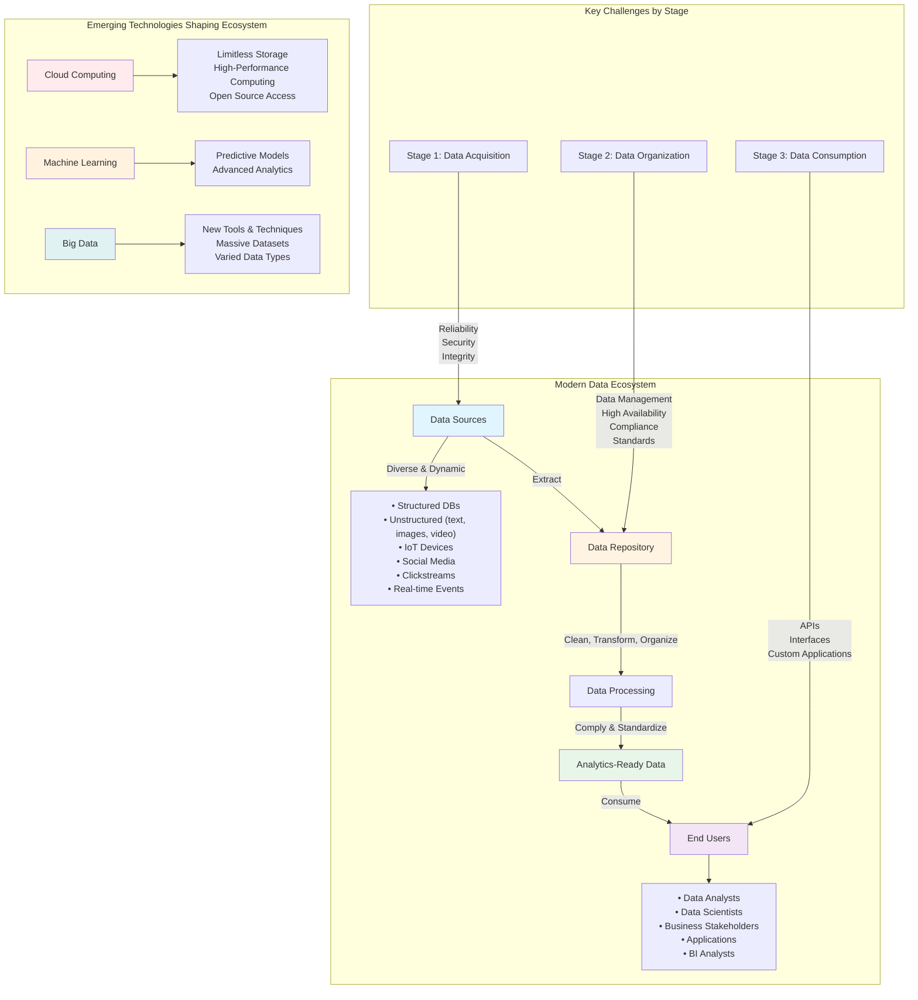

```mermaid
graph TB
    subgraph "Modern Data Ecosystem"
        DS[Data Sources] --> |Extract| DR[Data Repository]
        DS --> |Diverse & Dynamic| Types["• Structured DBs<br/>• Unstructured (text, images, video)<br/>• IoT Devices<br/>• Social Media<br/>• Clickstreams<br/>• Real-time Events"]
        
        DR --> |Clean, Transform, Organize| Process[Data Processing]
        Process --> |Comply & Standardize| Ready[Analytics-Ready Data]
        
        Ready --> |Consume| Users[End Users]
        Users --> Stakeholders["• Data Analysts<br/>• Data Scientists<br/>• Business Stakeholders<br/>• Applications<br/>• BI Analysts"]
    end
    
    subgraph "Key Challenges by Stage"
        C1[Stage 1: Data Acquisition] --> |"Reliability<br/>Security<br/>Integrity"| DS
        C2[Stage 2: Data Organization] --> |"Data Management<br/>High Availability<br/>Compliance<br/>Standards"| DR
        C3[Stage 3: Data Consumption] --> |"APIs<br/>Interfaces<br/>Custom Applications"| Users
    end
    
    subgraph "Emerging Technologies Shaping Ecosystem"
        Cloud[Cloud Computing] --> Impact["Limitless Storage<br/>High-Performance Computing<br/>Open Source Access"]
        ML[Machine Learning] --> Impact2["Predictive Models<br/>Advanced Analytics"]
        BD[Big Data] --> Impact3["New Tools & Techniques<br/>Massive Datasets<br/>Varied Data Types"]
    end
    
    style DS fill:#e1f5ff
    style DR fill:#fff4e1
    style Ready fill:#e8f5e9
    style Users fill:#f3e5f5
    style Cloud fill:#ffebee
    style ML fill:#fff3e0
    style BD fill:#e0f2f1
```
