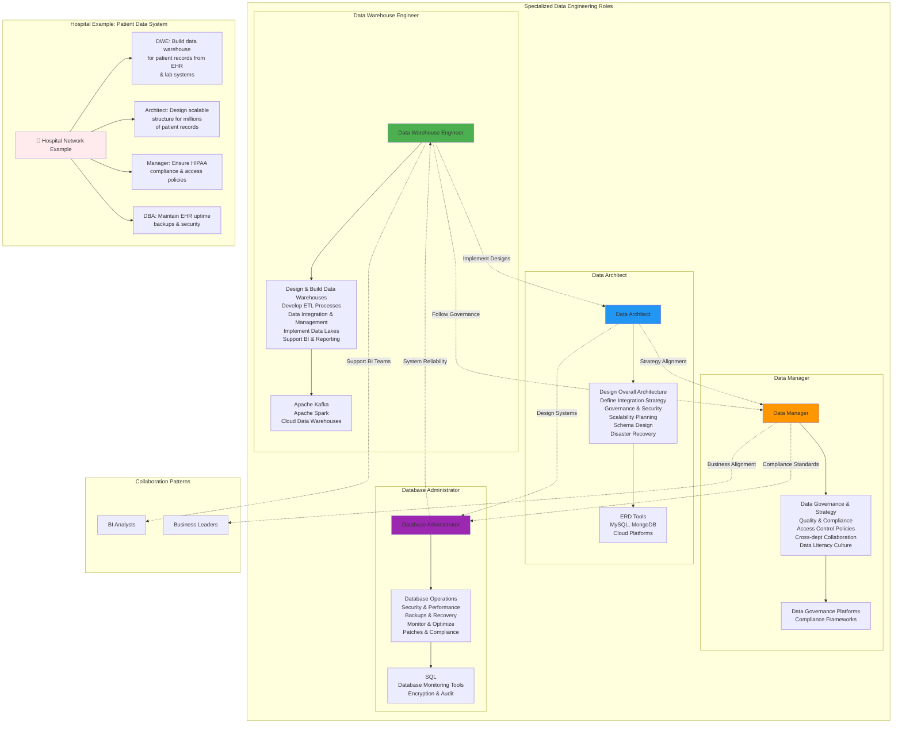

```mermaid
graph TB
    subgraph "Specialized Data Engineering Roles"
        
        subgraph "Data Warehouse Engineer"
            DWE[Data Warehouse Engineer]
            DWE --> DWEResp["Design & Build Data Warehouses<br/>Develop ETL Processes<br/>Data Integration & Management<br/>Implement Data Lakes<br/>Support BI & Reporting"]
            DWEResp --> DWETools["Apache Kafka<br/>Apache Spark<br/>Cloud Data Warehouses"]
        end
        
        subgraph "Data Architect"
            ARCH[Data Architect]
            ARCH --> ARCHResp["Design Overall Architecture<br/>Define Integration Strategy<br/>Governance & Security<br/>Scalability Planning<br/>Schema Design<br/>Disaster Recovery"]
            ARCHResp --> ARCHTools["ERD Tools<br/>MySQL, MongoDB<br/>Cloud Platforms"]
        end
        
        subgraph "Data Manager"
            DM[Data Manager]
            DM --> DMResp["Data Governance & Strategy<br/>Quality & Compliance<br/>Access Control Policies<br/>Cross-dept Collaboration<br/>Data Literacy Culture"]
            DMResp --> DMTools["Data Governance Platforms<br/>Compliance Frameworks"]
        end
        
        subgraph "Database Administrator"
            DBA[Database Administrator]
            DBA --> DBAResp["Database Operations<br/>Security & Performance<br/>Backups & Recovery<br/>Monitor & Optimize<br/>Patches & Compliance"]
            DBAResp --> DBATools["SQL<br/>Database Monitoring Tools<br/>Encryption & Audit"]
        end
    end
    
    subgraph "Collaboration Patterns"
        DWE -.->|Implement Designs| ARCH
        DWE -.->|Follow Governance| DM
        DWE -.->|Support BI Teams| BiAnalysts[BI Analysts]
        
        ARCH -.->|Design Systems| DBA
        ARCH -.->|Strategy Alignment| DM
        
        DM -.->|Compliance Standards| DBA
        DM -.->|Business Alignment| BizLeaders[Business Leaders]
        
        DBA -.->|System Reliability| DWE
    end
    
    subgraph "Hospital Example: Patient Data System"
        HospEx["🏥 Hospital Network Example"]
        HospEx --> DWEH["DWE: Build data warehouse<br/>for patient records from EHR<br/>& lab systems"]
        HospEx --> ARCHH["Architect: Design scalable<br/>structure for millions<br/>of patient records"]
        HospEx --> DMH["Manager: Ensure HIPAA<br/>compliance & access policies"]
        HospEx --> DBAH["DBA: Maintain EHR uptime<br/>backups & security"]
    end
    
    style DWE fill:#4CAF50
    style ARCH fill:#2196F3
    style DM fill:#FF9800
    style DBA fill:#9C27B0
    style HospEx fill:#ffebee
```