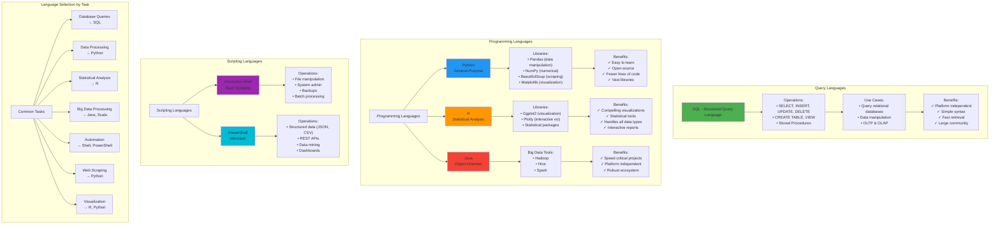

```mermaid
graph TB
    subgraph "Query Languages"
        SQL[SQL - Structured Query Language]
        SQL --> SQL_Ops["Operations:<br/>• SELECT, INSERT, UPDATE, DELETE<br/>• CREATE TABLE, VIEW<br/>• Stored Procedures"]
        SQL_Ops --> SQL_Use["Use Cases:<br/>• Query relational databases<br/>• Data manipulation<br/>• OLTP & OLAP"]
        SQL_Use --> SQL_Benefits["Benefits:<br/>✓ Platform independent<br/>✓ Simple syntax<br/>✓ Fast retrieval<br/>✓ Large community"]
    end
    
    subgraph "Programming Languages"
        PL[Programming Languages]
        
        PL --> Python["Python<br/>General-Purpose"]
        Python --> Py_Libs["Libraries:<br/>• Pandas (data manipulation)<br/>• NumPy (numerical)<br/>• BeautifulSoup (scraping)<br/>• Matplotlib (visualization)"]
        Py_Libs --> Py_Benefits["Benefits:<br/>✓ Easy to learn<br/>✓ Open-source<br/>✓ Fewer lines of code<br/>✓ Vast libraries"]
        
        PL --> R["R<br/>Statistical Analysis"]
        R --> R_Libs["Libraries:<br/>• Ggplot2 (visualization)<br/>• Plotly (interactive viz)<br/>• Statistical packages"]
        R_Libs --> R_Benefits["Benefits:<br/>✓ Compelling visualizations<br/>✓ Statistical tools<br/>✓ Handles all data types<br/>✓ Interactive reports"]
        
        PL --> Java["Java<br/>Object-Oriented"]
        Java --> Java_BigData["Big Data Tools:<br/>• Hadoop<br/>• Hive<br/>• Spark"]
        Java_BigData --> Java_Benefits["Benefits:<br/>✓ Speed-critical projects<br/>✓ Platform independent<br/>✓ Robust ecosystem"]
    end
    
    subgraph "Scripting Languages"
        SL[Scripting Languages]
        
        SL --> Bash["Unix/Linux Shell<br/>Bash Scripting"]
        Bash --> Bash_Ops["Operations:<br/>• File manipulation<br/>• System admin<br/>• Backups<br/>• Batch processing"]
        
        SL --> PowerShell["PowerShell<br/>Microsoft"]
        PowerShell --> PS_Ops["Operations:<br/>• Structured data (JSON, CSV)<br/>• REST APIs<br/>• Data mining<br/>• Dashboards"]
    end
    
    subgraph "Language Selection by Task"
        Task[Common Tasks]
        
        Task --> T1["Database Queries<br/>→ SQL"]
        Task --> T2["Data Processing<br/>→ Python"]
        Task --> T3["Statistical Analysis<br/>→ R"]
        Task --> T4["Big Data Processing<br/>→ Java, Scala"]
        Task --> T5["Automation<br/>→ Shell, PowerShell"]
        Task --> T6["Web Scraping<br/>→ Python"]
        Task --> T7["Visualization<br/>→ R, Python"]
    end
    
    style SQL fill:#4CAF50
    style Python fill:#2196F3
    style R fill:#FF9800
    style Java fill:#F44336
    style Bash fill:#9C27B0
    style PowerShell fill:#00BCD4
```