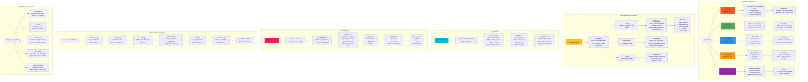

```mermaid
graph TB
    subgraph "The 5 V's of Big Data"
        BigData[Big Data]
        
        BigData --> Velocity["VELOCITY<br/>Speed of Data"]
        Velocity --> V1_Char["• Data generated extremely fast<br/>• Never stops<br/>• Real-time streaming<br/>• Cloud processing"]
        V1_Char --> V1_Ex["Example:<br/>Hours of YouTube footage<br/>uploaded every 60 seconds"]
        
        BigData --> Volume["VOLUME<br/>Scale of Data"]
        Volume --> V2_Char["• Massive amounts<br/>• Continuous growth<br/>• Scalable infrastructure"]
        V2_Char --> V2_Ex["Example:<br/>2.5 quintillion bytes/day<br/>= 10 million Blu-ray DVDs"]
        
        BigData --> Variety["VARIETY<br/>Diversity of Data"]
        Variety --> V3_Char["• Structured<br/>• Semi-structured<br/>• Unstructured<br/>• Multiple sources"]
        V3_Char --> V3_Ex["Examples:<br/>Text, images, video,<br/>sensor data, social media"]
        
        BigData --> Veracity["VERACITY<br/>Quality of Data"]
        Veracity --> V4_Char["• Consistency<br/>• Completeness<br/>• Integrity<br/>• Accuracy"]
        V4_Char --> V4_Ex["Challenge:<br/>80% unstructured<br/>Must produce reliable insights"]
        
        BigData --> Value["VALUE<br/>Insight Generation"]
        Value --> V5_Char["• Business value<br/>• Medical benefits<br/>• Social benefits<br/>• Customer satisfaction"]
        V5_Char --> V5_Ex["Goal:<br/>Turn data into actionable<br/>insights and value"]
    end
    
    subgraph "Apache Hadoop Ecosystem"
        Hadoop[Apache Hadoop]
        
        Hadoop --> H_Def["Java-based<br/>open-source framework<br/>for distributed storage<br/>& processing"]
        
        H_Def --> HDFS["HDFS<br/>Hadoop Distributed File System"]
        HDFS --> HDFS_How["How it works:<br/>• Split files across nodes<br/>• Parallel access<br/>• Replicate blocks (3x)<br/>• Fault-tolerant"]
        HDFS_How --> HDFS_Benefits["Benefits:<br/>✓ Fast recovery<br/>✓ Streaming data<br/>✓ Large datasets<br/>✓ Portable<br/>✓ Data locality"]
        
        H_Def --> MapReduce["MapReduce<br/>Processing Model"]
        MapReduce --> MR_How["How it works:<br/>• Map: Split & process<br/>• Reduce: Aggregate results<br/>• Parallel computation"]
        
        H_Def --> YARN["YARN<br/>Resource Manager"]
        YARN --> YARN_How["How it works:<br/>• Manage cluster resources<br/>• Schedule jobs<br/>• Monitor nodes"]
    end
    
    subgraph "Apache Hive"
        Hive[Apache Hive]
        
        Hive --> Hive_Def["Data warehouse software<br/>on top of Hadoop"]
        
        Hive_Def --> Hive_Char["Characteristics:<br/>• SQL-like interface<br/>• High latency queries<br/>• Read-based<br/>• Long sequential scans"]
        
        Hive_Char --> Hive_Use["Best For:<br/>• ETL operations<br/>• Data warehousing<br/>• Reporting<br/>• Data analysis"]
        
        Hive_Use --> Hive_Not["Not Good For:<br/>• Fast response times<br/>• Transaction processing<br/>• High write operations"]
    end
    
    subgraph "Apache Spark"
        Spark[Apache Spark]
        
        Spark --> Spark_Def["General-purpose<br/>data processing engine"]
        
        Spark_Def --> Spark_Key["KEY FEATURE:<br/>In-Memory Processing<br/>→ Significantly faster"]
        
        Spark_Key --> Spark_Apps["Applications:<br/>• Interactive Analytics<br/>• Stream Processing<br/>• Machine Learning<br/>• Data Integration<br/>• ETL"]
        
        Spark_Apps --> Spark_Lang["Languages:<br/>• Java, Scala<br/>• Python, R<br/>• SQL"]
        
        Spark_Lang --> Spark_Deploy["Deployment:<br/>• Standalone<br/>• On Hadoop<br/>• Other infrastructures"]
        
        Spark_Deploy --> Spark_Sources["Data Sources:<br/>• HDFS<br/>• Hive<br/>• Many others"]
    end
    
    subgraph "Big Data Processing Flow"
        Flow[End-to-End Workflow]
        
        Flow --> F1["Data Sources<br/>IoT, Social Media,<br/>Transactions"]
        F1 --> F2["Ingestion<br/>Kafka, Flume,<br/>Real-time Streaming"]
        F2 --> F3["Storage<br/>HDFS, Cloud Storage,<br/>Data Lake"]
        F3 --> F4["Processing<br/>Spark, Hadoop MapReduce,<br/>Distributed Computing"]
        F4 --> F5["Analysis<br/>Hive, Spark SQL,<br/>Complex Queries"]
        F5 --> F6["Visualization<br/>Tableau, Power BI,<br/>Dashboards"]
        F6 --> F7["Insights & Actions<br/>Business Decisions"]
    end
    
    subgraph "Technology Comparison"
        Comp[Hadoop vs Spark]
        
        Comp --> C1["Processing:<br/>Hadoop: Disk-based<br/>Spark: In-memory"]
        
        Comp --> C2["Speed:<br/>Hadoop: Slower<br/>Spark: 100x faster"]
        
        Comp --> C3["Best For:<br/>Hadoop: Batch processing<br/>Spark: Real-time + batch"]
        
        Comp --> C4["Use Case:<br/>Hadoop: Large batch jobs<br/>Spark: Interactive analytics"]
        
        Comp --> C5["Learning Curve:<br/>Hadoop: Steeper<br/>Spark: Easier (Python API)"]
    end
    
    style Velocity fill:#FF5722
    style Volume fill:#4CAF50
    style Variety fill:#2196F3
    style Veracity fill:#FF9800
    style Value fill:#9C27B0
    style Hadoop fill:#FFC107
    style Hive fill:#00BCD4
    style Spark fill:#E91E63
```    