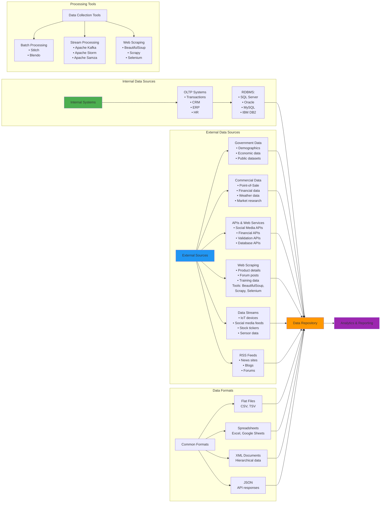

```mermaid
graph LR
    subgraph "Internal Data Sources"
        Internal[Internal Systems]
        Internal --> OLTP["OLTP Systems<br/>• Transactions<br/>• CRM<br/>• ERP<br/>• HR"]
        OLTP --> RDBMS["RDBMS:<br/>• SQL Server<br/>• Oracle<br/>• MySQL<br/>• IBM DB2"]
    end
    
    subgraph "External Data Sources"
        External[External Sources]
        
        External --> GovData["Government Data<br/>• Demographics<br/>• Economic data<br/>• Public datasets"]
        
        External --> CommData["Commercial Data<br/>• Point-of-Sale<br/>• Financial data<br/>• Weather data<br/>• Market research"]
        
        External --> APIs["APIs & Web Services<br/>• Social Media APIs<br/>• Financial APIs<br/>• Validation APIs<br/>• Database APIs"]
        
        External --> WebScrape["Web Scraping<br/>• Product details<br/>• Forum posts<br/>• Training data<br/>Tools: BeautifulSoup,<br/>Scrapy, Selenium"]
        
        External --> Streams["Data Streams<br/>• IoT devices<br/>• Social media feeds<br/>• Stock tickers<br/>• Sensor data"]
        
        External --> RSS["RSS Feeds<br/>• News sites<br/>• Blogs<br/>• Forums"]
    end
    
    subgraph "Data Formats"
        Format[Common Formats]
        Format --> FlatFiles["Flat Files<br/>CSV, TSV"]
        Format --> Spreadsheets["Spreadsheets<br/>Excel, Google Sheets"]
        Format --> XMLFiles["XML Documents<br/>Hierarchical data"]
        Format --> JSONFiles["JSON<br/>API responses"]
    end
    
    subgraph "Processing Tools"
        Tools[Data Collection Tools]
        Tools --> Batch["Batch Processing<br/>• Stitch<br/>• Blendo"]
        Tools --> Stream["Stream Processing<br/>• Apache Kafka<br/>• Apache Storm<br/>• Apache Samza"]
        Tools --> Scraping["Web Scraping<br/>• BeautifulSoup<br/>• Scrapy<br/>• Selenium"]
    end
    
    RDBMS --> DataRepo[Data Repository]
    GovData --> DataRepo
    CommData --> DataRepo
    APIs --> DataRepo
    WebScrape --> DataRepo
    Streams --> DataRepo
    RSS --> DataRepo
    
    FlatFiles --> DataRepo
    Spreadsheets --> DataRepo
    XMLFiles --> DataRepo
    JSONFiles --> DataRepo
    
    DataRepo --> Analytics[Analytics & Reporting]
    
    style Internal fill:#4CAF50
    style External fill:#2196F3
    style DataRepo fill:#FF9800
    style Analytics fill:#9C27B0
```
    