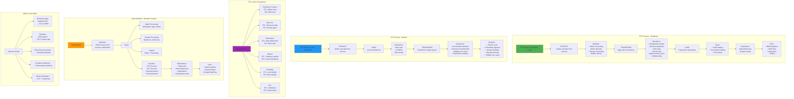

```mermaid
graph TB
    subgraph "ETL Process - Traditional"
        ETL[ETL: Extract, Transform, Load]
        
        ETL --> E1["EXTRACT<br/>Gather raw data from sources"]
        E1 --> E1_Methods["Methods:<br/>• Batch Processing<br/>  (Stitch, Blendo)<br/>• Stream Processing<br/>  (Kafka, Storm)"]
        
        E1_Methods --> T1["TRANSFORM<br/>Apply rules & functions"]
        T1 --> T1_Ops["Operations:<br/>• Standardize formats<br/>• Remove duplicates<br/>• Filter data<br/>• Enrich data<br/>• Apply business rules<br/>• Validate data"]
        
        T1_Ops --> L1["LOAD<br/>Transport to destination"]
        L1 --> L1_Types["Types:<br/>• Initial loading<br/>• Incremental loading<br/>• Full refresh"]
        
        L1_Types --> ETL_Dest["Destination:<br/>Data Warehouse<br/>Analysis-ready"]
        
        ETL_Dest --> ETL_Tools["Tools:<br/>• IBM InfoSphere<br/>• AWS Glue<br/>• Informatica<br/>• Talend"]
    end
    
    subgraph "ELT Process - Modern"
        ELT[ELT: Extract, Load, Transform]
        
        ELT --> E2["EXTRACT<br/>Gather raw data from sources"]
        
        E2 --> L2["LOAD<br/>Load raw data first"]
        L2 --> L2_Dest["Destination:<br/>Data Lake<br/>(or DWH)<br/>Raw format"]
        
        L2_Dest --> T2["TRANSFORM<br/>Transform in target system"]
        T2 --> T2_Ops["Operations:<br/>• On-demand transform<br/>• Selective transformation<br/>• Multiple use cases<br/>• Exploratory analysis"]
        
        T2_Ops --> ELT_Benefits["Benefits:<br/>✓ Shorter cycle<br/>✓ Immediate ingestion<br/>✓ Greater flexibility<br/>✓ Big Data friendly<br/>✓ Multiple use cases"]
    end
    
    subgraph "ETL vs ELT Comparison"
        Compare[Key Differences]
        
        Compare --> Diff1["Transform Location:<br/>ETL: Before load<br/>ELT: After load"]
        
        Compare --> Diff2["Best For:<br/>ETL: Structured data<br/>ELT: All data types"]
        
        Compare --> Diff3["Destination:<br/>ETL: Data Warehouse<br/>ELT: Data Lake"]
        
        Compare --> Diff4["Speed:<br/>ETL: Transform upfront<br/>ELT: Load immediately"]
        
        Compare --> Diff5["Flexibility:<br/>ETL: Less flexible<br/>ELT: More flexible"]
        
        Compare --> Diff6["Era:<br/>ETL: Traditional<br/>ELT: Cloud-native"]
    end
    
    subgraph "Data Pipelines - Broader Concept"
        Pipeline[Data Pipeline]
        
        Pipeline --> P_Def["Definition:<br/>Entire journey from<br/>source to destination"]
        
        P_Def --> P_Types["Types"]
        P_Types --> P_Batch["Batch Processing<br/>Scheduled, large chunks"]
        P_Types --> P_Stream["Stream Processing<br/>Real-time, continuous"]
        P_Types --> P_Hybrid["Hybrid<br/>Batch + Streaming"]
        
        P_Types --> P_Subset["Includes:<br/>• ETL Process<br/>• ELT Process<br/>• Data Movement<br/>• Transformations"]
        
        P_Subset --> P_Dest["Destinations:<br/>• Data Lake<br/>• Data Warehouse<br/>• Applications<br/>• Visualization tools"]
        
        P_Dest --> P_Tools["Tools:<br/>• Apache Airflow<br/>• Apache Beam<br/>• Google DataFlow"]
    end
    
    subgraph "When to Use What"
        Use[Selection Guide]
        
        Use --> U1["Structured data,<br/>traditional BI?<br/>→ ETL to DWH"]
        
        Use --> U2["Big Data,<br/>cloud-native?<br/>→ ELT to Data Lake"]
        
        Use --> U3["Real-time processing?<br/>→ Streaming Pipeline"]
        
        Use --> U4["Complex workflows?<br/>→ Orchestration (Airflow)"]
        
        Use --> U5["ML/AI workloads?<br/>→ ELT + Lakehouse"]
    end
    
    style ETL fill:#4CAF50
    style ELT fill:#2196F3
    style Pipeline fill:#FF9800
    style Compare fill:#9C27B0
```    