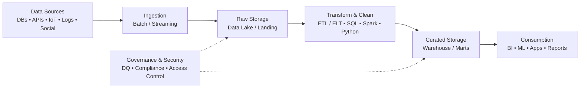
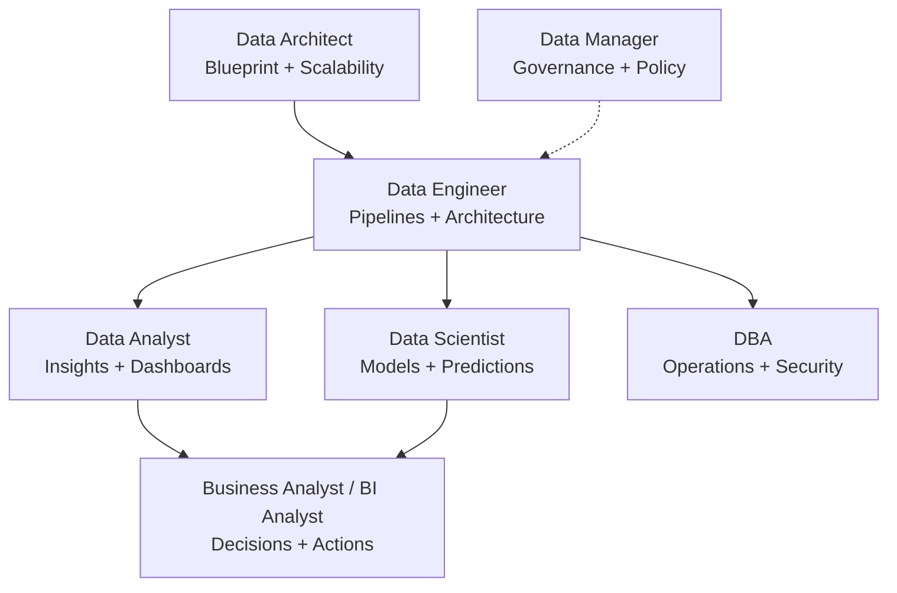

# Diagrams — Data Engineering Ecosystem (Mermaid)

## 1) End-to-end data flow

```mermaid
flowchart LR
  A[Data Sources<br/>DBs • APIs • IoT • Logs • Social] --> B[Ingestion<br/>Batch / Streaming]
  B --> C[Raw Storage<br/>Data Lake / Landing]
  C --> D[Transform & Clean<br/>ETL / ELT • SQL • Spark • Python]
  D --> E[Curated Storage<br/>Warehouse / Marts]
  E --> F[Consumption<br/>BI • ML • Apps • Reports]
  G[Governance & Security<br/>DQ • Compliance • Access Control] -.-> C
  G -.-> E
```

## 2) Data engineering roles

```mermaid
flowchart TB
  DE[Data Engineer<br/>Pipelines + Architecture]
  DA[Data Analyst<br/>Insights + Dashboards]
  DS[Data Scientist<br/>Models + Predictions]
  BA[Business Analyst / BI Analyst<br/>Decisions + Actions]

  ARCH[Data Architect<br/>Blueprint + Scalability]
  DM[Data Manager<br/>Governance + Policy]
  DBA[DBA<br/>Operations + Security]

  ARCH --> DE
  DM -.-> DE
  DE --> DBA
  DE --> DA
  DE --> DS
  DA --> BA
  DS --> BA
```

## 3) Data engineering ecosystem

```mermaid
flowchart LR
  A[Data Sources<br/>DBs • APIs • IoT • Logs • Social] --> B[Ingestion<br/>Batch / Streaming]
  B --> C[Raw Storage<br/>Data Lake / Landing]
  C --> D[Transform & Clean<br/>ETL / ELT • SQL • Spark • Python]
  D --> E[Curated Storage<br/>Warehouse / Marts]
  E --> F[Consumption<br/>BI • ML • Apps • Reports]
  G[Governance & Security<br/>DQ • Compliance • Access Control] -.-> C
  G -.-> E
```